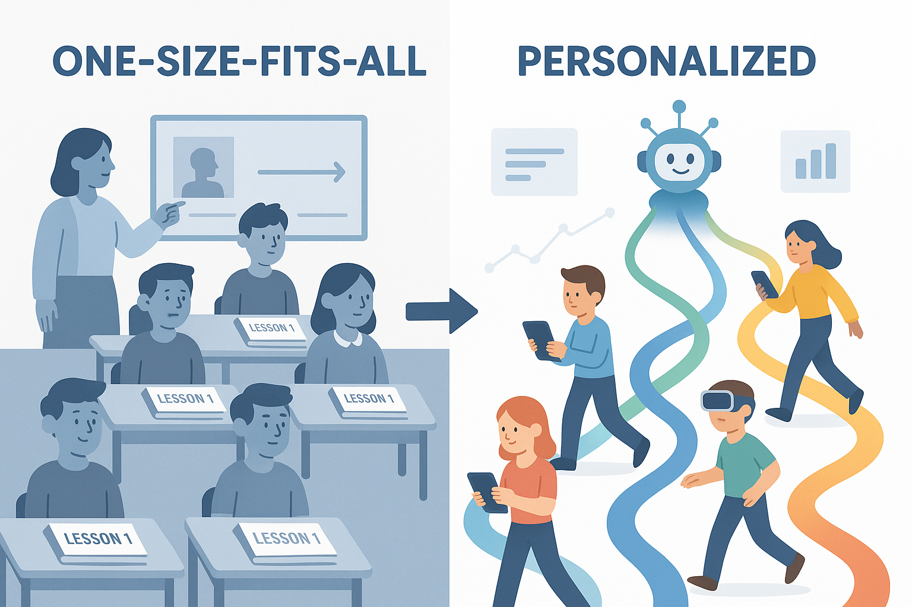

by Junquan PAN

<h1 align="center">Introduction</h1>

For decades, educators and technologists have dreamed of reconciling two seemingly opposite goals in education: **personalization** and **scalability**.

**Personalization** means teaching every learner according to their needs, pace, and interests — the essence of good pedagogy.

**Scalability** means reaching millions efficiently — the essence of modern education systems.

For years, the two have felt incompatible. But Google’s experimental project *Learn Your Way* may be the first serious attempt to bridge this divide — combining the *scale of technology* with the *human richness of personalized learning*.

<h1 align="center">What is Learn Your Way</h1>

Developed by Google Research, *Learn Your Way* is an **AI-powered platform that transforms static textbooks into adaptive, multimodal learning experiences**.

Students can upload or access a piece of content — say, a chapter from a biology textbook — and the system automatically offers multiple ways to learn it:

- Simplified or more advanced versions depending on the learner’s level.
- Examples rewritten around a learner’s interests (e.g., sports, music, or science fiction).
- Visual diagrams, narrated summaries, or concise slide decks.
- Interactive quizzes that give instant feedback and help learners review difficult parts.

In short, the same learning material becomes *alive* — flexible, interactive, and tailored.

### Why *Learn Your Way* Is Different

Unlike previous generations of edtech or AI tutoring systems, *Learn Your Way* does something revolutionary: it **combines scalability and personalization**, which people in the past thought was impossible. Traditional adaptive platforms (like Knewton or ALEKS) personalized learning but required massive amounts of pre-authored content. Conversational AI tutors (like ChatGPT or Khanmigo) can personalize dialogue but often lack curriculum alignment and structure. 

*Learn Your Way* changes the game. It **automatically transforms existing, curriculum-aligned materials** into personalized versions, eliminating the need for teachers to manually create every differentiated pathway. That makes it not only scalable but also sustainable for real-world education systems.

### Grounded in Learning Science

What makes *Learn Your Way* especially exciting is that it doesn’t just use AI for novelty — it’s **rooted in cognitive science**. Its multimodal learning design reflects decades of research on how people learn best.

#### 1. Dual Coding Theory

According to Allan Paivio’s *Dual Coding Theory*, the brain processes information through two channels — verbal and visual. By offering both words and visuals, *Learn Your Way* strengthens conceptual understanding and memory retention.

> “We learn best when words and visuals complement rather than compete.”

*Illustration: diagram showing verbal and visual processing channels*

#### 2. Cognitive Theory of Multimedia Learning

Richard Mayer’s work shows that combining text, visuals, and audio — when done right — reduces cognitive overload and helps learners build mental models. The system’s use of narrated slides, segmented micro-lessons, and concise visuals directly applies these principles.

#### 3. Cognitive Load Theory

Human working memory is limited. *Learn Your Way* manages cognitive load by simplifying texts for beginners and offering multimodal explanations to distribute mental effort efficiently.

#### 4. Personalized and Adaptive Learning

Grounded in Vygotsky’s *Zone of Proximal Development* and Bruner’s *Scaffolding*, the tool dynamically adjusts difficulty and examples to keep learners within their optimal challenge zone — never too easy, never too hard.

#### 5. Retrieval Practice and Feedback

Micro-quizzes and checkpoints integrate *retrieval practice* — one of the most reliable methods for improving long-term retention. By offering immediate feedback, the system turns passive reading into active learning.

#### 6. Self-Regulated Learning and Agency

Perhaps most importantly, *Learn Your Way* lets learners **choose their preferred modality** — reading, listening, or visualizing. This promotes *metacognition* and *agency*, helping students learn how they learn.

*Illustration: infographic summarizing key learning science theories*

### Evidence and Early Findings

In a lab experiment (https://arxiv.org/abs/2509.18664) with 60 U.S. high school students (ages 15–18), participants who used Learn Your Way scored approximately 9 percentage points higher on an immediate comprehension/recall test and 11 percentage points higher on a delayed (3-day) retention test, compared to peers using a standard digital PDF reader. Students in the Learn Your Way condition also reported more favorable learning experiences, greater comfort with the assessments, and higher willingness to use the tool in future. Although the study is small-scale and limited to one content domain in a lab setting, these findings suggest that AI-driven multimodal content transformations, anchored in learning science principles, may meaningfully enhance learning outcomes.

### Why It Matters for the Future of AI in Education

1. **From Content Delivery → Content Transformation**  
   Most educational AI tools deliver or recommend content. *Learn Your Way* transforms it — adapting structure, tone, and modality automatically.
2. **From Chatbots → Curricular Systems**  
   Instead of answering isolated questions, the system reimagines the *entire textbook* experience.
3. **From Automation → Augmentation**  
   It doesn’t replace teachers; it empowers them. Educators could use such tools to differentiate materials instantly, saving hours of manual work.
4. **From Theory → Practice**  
   For the first time, key principles from learning science (like dual coding and cognitive load theory) are operationalized by generative AI at scale.

<h1 align="center">Concluding Thoughts</h1>

**Learn Your Way** is more than a new AI tool — it’s a proof of concept that **personalized learning at scale is now within reach**.

For decades, education faced a painful trade-off:

- scale meant standardization;
- personalization meant human effort and cost.

Now, with AI systems capable of *automatically transforming educational materials* while staying true to pedagogy, that trade-off is beginning to dissolve. It’s early days, and there are still challenges around trust, fidelity, and integration. But if this trajectory continues, the future classroom may not hand students a textbook — it may hand them **a living, adaptive learning companion** that truly lets them *learn their way*.

